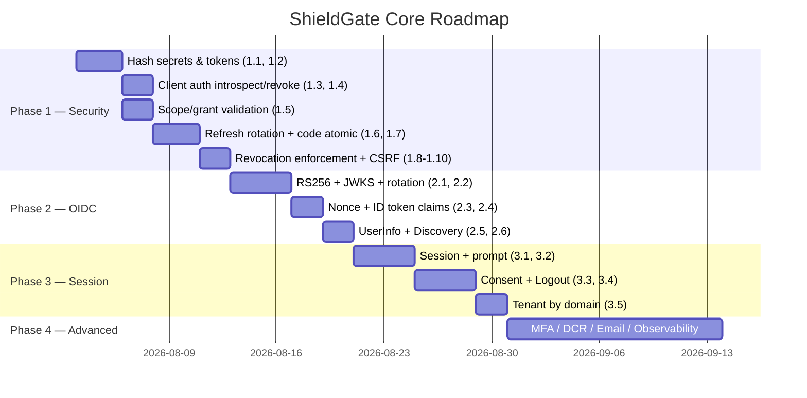

# ShieldGate — Roadmap hoàn thiện Core Features (AuthZ Server)

> Trạng thái khảo sát: 2026-08-01, branch `claude/auth-server-production-ready-n982ew`.
> Mục tiêu: đưa ShieldGate từ mức "hoạt động được" lên mức **production-ready, tuân thủ chuẩn OAuth 2.0 / OIDC**.

## 1. Hiện trạng

### Đã có (hoạt động)
- Authorization Code + PKCE (S256), Refresh Token grant, Client Credentials grant
- Token introspection (RFC 7662), revocation (RFC 7009) — ở mức cơ bản
- OIDC Discovery, JWKS (stub), UserInfo, ID Token (HS256)
- Multi-tenancy (tenant CRUD, X-Tenant-ID), User/Client CRUD, RBAC đầy đủ, Audit logging
- Rate limiting per-IP qua Redis, account lockout sau N lần login sai, login page HTML

### Gap đã xác định (theo file:line)

| # | Gap | Vị trí | Mức độ |
|---|-----|--------|--------|
| G1 | Client secret lưu **plaintext**, so sánh `!=` (không constant-time) | `internal/services/client_service_impl.go:204`, `models.go:204` | 🔴 Critical |
| G2 | Access/refresh token lưu **plaintext** trong DB | `auth_service_impl.go:135-161` | 🔴 Critical |
| G3 | Introspect & Revoke **không yêu cầu client authentication** (vi phạm RFC 7662 §2.1, RFC 7009 §2.1) | `oauth_handler.go:436-484` | 🔴 Critical |
| G4 | JWT chỉ hỗ trợ **HS256** — client bên thứ 3 không thể verify ID token; JWKS là stub không có key material | `auth_service_impl.go:312,388`, `oauth_handler.go:422-433` | 🔴 Critical |
| G5 | `nonce` nhận ở /authorize nhưng **không lưu vào auth code, không đưa vào ID token** (vi phạm OIDC Core §3.1.3.7) | `oauth_handler.go:87`, `models.go:216-228` | 🔴 Critical |
| G6 | **Scope không được validate** với `client.Scopes`; grant type không check với `client.GrantTypes` | `oauth_handler.go`, `auth_service_impl.go` | 🔴 Critical |
| G7 | Refresh grant **mất scope** (`GenerateTokens(..., "", false)`), không reuse-detection, không revoke token family | `auth_service_impl.go:204` | 🔴 Critical |
| G8 | Revoke JWT xong **token vẫn valid** — `ValidateAccessToken` chỉ check chữ ký, không check DB/denylist | `auth_service_impl.go:264-285`, `middleware.go` | 🔴 Critical |
| G9 | Login form **không có CSRF protection** | `oauth_handler.go:132`, `templates/login.html` | 🟠 High |
| G10 | Auth code exchange không atomic (race → dùng code 2 lần); code reuse không revoke token đã cấp (RFC 6749 §4.1.2) | `auth_service_impl.go:70-119` | 🟠 High |
| G11 | client_credentials **cấp cả refresh token** (sai RFC 6749 §4.4.3), user_id = uuid.Nil lưu vào DB | `oauth_handler.go:365` | 🟠 High |
| G12 | Chỉ hỗ trợ `client_secret_post`, chưa có `client_secret_basic` (Authorization header) | `oauth_handler.go:267-283` | 🟠 High |
| G13 | **Không có session/SSO** — mỗi lần authorize phải login lại; không có `prompt=`, `max_age`, logout | toàn bộ flow | 🟠 High |
| G14 | **Không có consent screen** — auto-approve mọi scope sau login | `oauth_handler.go:195` | 🟠 High |
| G15 | Discovery thiếu `grant_types_supported`, `token_endpoint_auth_methods_supported`, `code_challenge_methods_supported`, `revocation_endpoint`, `introspection_endpoint` | `auth_service_impl.go:342-355` | 🟡 Medium |
| G16 | ID token thiếu `auth_time`, `at_hash`; expiry hardcode 1h | `auth_service_impl.go:300-314` | 🟡 Medium |
| G17 | UserInfo: `email_verified` hardcode `true`, không trả claims theo scope (profile/email) | `auth_service_impl.go:334-339` | 🟡 Medium |
| G18 | Tenant resolution qua header `X-Tenant-ID` — không khả thi cho browser redirect flow | `middleware.go`, tất cả handlers | 🟡 Medium |
| G19 | Helper `contains()` cho scope matching có logic lỗi | `auth_service_impl.go:401-406` | 🟡 Medium |
| G20 | JWT_SECRET tĩnh, không có key rotation | `config` | 🟡 Medium |
| G21 | Idempotency key TODO chưa làm | `tenant_handler.go:71` | 🟢 Low |
| G22 | Email verification / password reset stub trong UserService | `user_service_impl.go:305-317` | 🟢 Low |

---

## 2. Roadmap theo Phase

### Phase 1 — Security Hardening lõi (ưu tiên cao nhất, ~1–2 tuần)
> Mục tiêu: vá các lỗ hổng khiến server không thể deploy production. Không đổi API surface.

| Task | Gaps | Việc cụ thể |
|------|------|-------------|
| 1.1 Hash client secret | G1 | bcrypt khi tạo client, chỉ trả secret 1 lần ở response Create; verify bằng `bcrypt.CompareHashAndPassword`. Migration cho client hiện hữu. |
| 1.2 Hash token trong DB | G2 | Lưu SHA-256(token) cho access/refresh token; lookup theo hash. |
| 1.3 Client auth cho introspect/revoke | G3 | Bắt buộc client credentials (basic hoặc post); revoke chỉ cho token thuộc về client đó. |
| 1.4 `client_secret_basic` | G12 | Parse `Authorization: Basic` ở token/introspect/revoke, fallback về form post. |
| 1.5 Validate scope & grant type | G6, G19 | Chuẩn hoá scope parser (viết lại `contains()`); check requested scope ⊆ `client.Scopes`, grant_type ∈ `client.GrantTypes` ở mọi grant. |
| 1.6 Refresh token rotation đúng | G7 | Giữ nguyên scope gốc (cho phép narrow), cấp lại ID token nếu có `openid`; thêm `family_id` + reuse detection → revoke cả family. |
| 1.7 Auth code atomic + reuse revoke | G10 | Delete-and-return trong 1 query (`DELETE ... RETURNING`); nếu code đã dùng → revoke các token đã cấp từ code đó. |
| 1.8 Enforce revocation | G8 | Middleware/`ValidateAccessToken` check denylist (Redis, TTL = thời gian còn lại của token) khi revoke JWT. |
| 1.9 CSRF cho login form | G9 | CSRF token trong session/hidden field, SameSite cookie. |
| 1.10 Sửa client_credentials | G11 | Không cấp refresh token; access token có `sub = client_id`; không ghi user_id nil. |

**Definition of Done Phase 1**: gosec + golangci-lint sạch; test coverage ≥80% cho các path sửa; integration test cho từng grant.

### Phase 2 — OIDC Compliance (~2 tuần)
> Mục tiêu: pass được OIDC conformance test cơ bản (basic certification profile).

| Task | Gaps | Việc cụ thể |
|------|------|-------------|
| 2.1 Ký bất đối xứng RS256/ES256 | G4 | Key pair per-server (config/KMS), header `kid`; giữ HS256 làm fallback config được. |
| 2.2 JWKS thật + key rotation | G4, G20 | Publish public key qua `/.well-known/jwks.json`; hỗ trợ ≥2 key đồng thời (current + next) để rotate không downtime. |
| 2.3 Nonce end-to-end | G5 | Thêm cột `nonce` vào `authorization_codes`; đưa vào ID token claims. |
| 2.4 ID token đầy đủ claims | G16 | `auth_time`, `at_hash`, expiry theo config; audience validation. |
| 2.5 UserInfo theo scope | G17 | Trả claims tương ứng scope `profile`/`email`; `email_verified` lấy từ user record. |
| 2.6 Discovery document đầy đủ | G15 | Bổ sung tất cả metadata bắt buộc/khuyến nghị theo OIDC Discovery 1.0. |

### Phase 3 — Session, Consent & SSO (~2 tuần)
> Mục tiêu: trải nghiệm authorization server thật sự (đăng nhập 1 lần, consent, logout).

| Task | Gaps | Việc cụ thể |
|------|------|-------------|
| 3.1 Server-side session | G13 | Session store (Redis), cookie `HttpOnly+Secure+SameSite`; /authorize check session → skip login. |
| 3.2 `prompt` & `max_age` | G13 | Hỗ trợ `prompt=none/login/consent`, `max_age`, trả `login_required`/`consent_required` đúng chuẩn. |
| 3.3 Consent screen | G14 | Trang consent hiển thị scope; lưu granted consent per (user, client, scope); skip nếu đã grant. |
| 3.4 Logout | G13 | `end_session_endpoint` (RP-initiated logout), revoke session + `post_logout_redirect_uri` validation. |
| 3.5 Tenant resolution theo domain | G18 | Resolve tenant từ `Host` header / path prefix cho browser flows; giữ `X-Tenant-ID` cho API M2M. |

### Phase 4 — Nâng cao & Production Ops (~2–3 tuần, chọn lọc theo nhu cầu)

| Task | Việc cụ thể |
|------|-------------|
| 4.1 MFA (TOTP) | Enroll/verify TOTP, bước 2 trong login flow, claim `amr`. |
| 4.2 Dynamic Client Registration (RFC 7591) | `POST /oauth/register` với initial access token. |
| 4.3 Email flows hoàn chỉnh | Verification + password reset end-to-end (G22), wiring UserService ↔ EmailService. |
| 4.4 Idempotency key | Hoàn thành TODO ở tenant handler (G21), áp dụng cho mọi POST management API. |
| 4.5 Observability | Prometheus metrics (`/metrics`), OpenTelemetry tracing, structured audit cho mọi token event. |
| 4.6 Conformance & load test | Chạy OIDC conformance suite; k6/vegeta load test token endpoint. |

---

## 3. Thứ tự thực thi đề xuất

Nguyên tắc:
- Phase 1 làm **trước và trọn vẹn** — mọi thứ sau đều xây trên nền security đúng.
- Mỗi task = 1 PR riêng, kèm unit + integration test, giữ coverage ≥ 80%.
- Migration DB (hash secret/token, cột nonce, family_id) viết theo kiểu expand-migrate-contract để không downtime.
